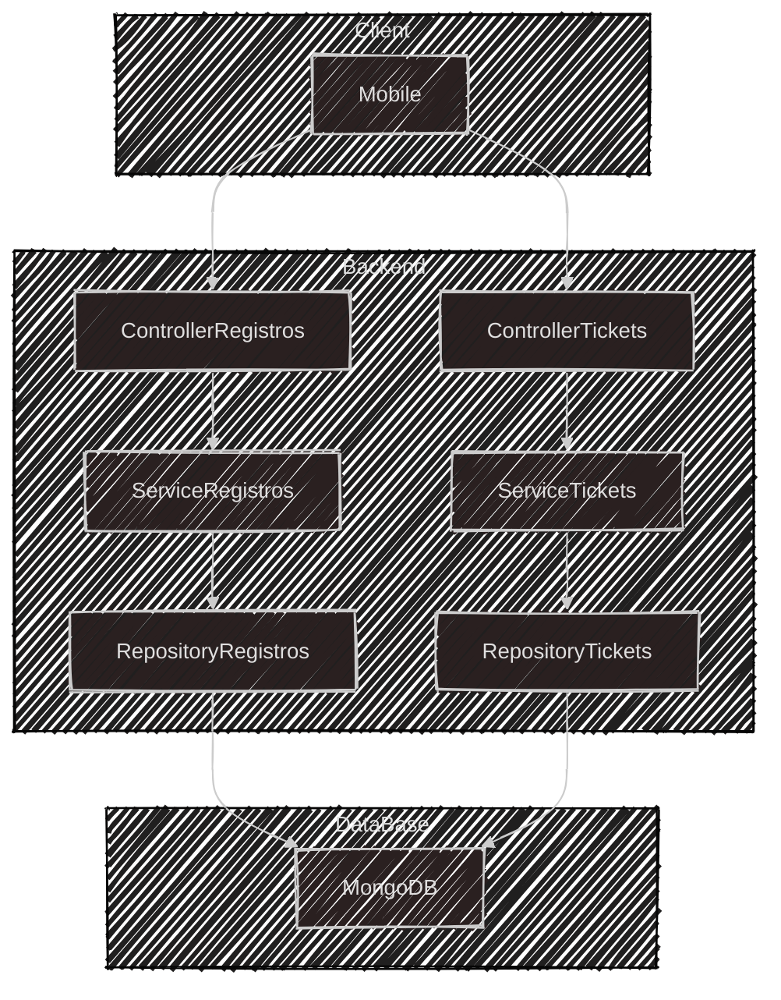

# 📝 Servico de Atendimento

API backend para gerenciamento de registros e tickets, com arquitetura em camadas (Controller, Service, Repository) para separar responsabilidades.

## 🚀 Tecnologias

- **Node.js**, **Express**, **Mongoose**

## 🔧 Como Rodar

1. Clone o repositório.
2. Instale as dependências: `npm install`
3. Inicie: `npm start`

## 📚 Endpoints

### Registros
- **POST** `/registro/submit` - Submete um novo registro.
- **GET** `/registro` - Retorna todos os registros.
- **DELETE** `/registro/:id` - Remove um registro pelo ID.
- **PUT** `/registro/:id` - Atualiza um registro pelo ID.

### Tickets
- **POST** `/ticket/submit` - Submete um novo ticket.
- **GET** `/ticket` - Retorna todos os tickets.
- **DELETE** `/ticket/:id` - Remove um ticket pelo ID.
- **PUT** `/ticket/:id` - Atualiza um ticket pelo ID.

# 📚 Documentação de Endpoints

# Ticket's 🎫

## POST
```json
{
    "ticket": "12345",
    "historico": "Cliente reclamou sobre o serviço",
    "idAtendente": "atendente01",
    "motivo": "Reclamação sobre atendimento"
}
```

## GET
```json
{
    "_id": "66da0ee2896a9bcb03240a7e",
    "identificador": "123",
    "titulo": "blabla",
    "telefone": "1234",
    "__v": 0
}
```

## PUT
```json
{
  "ticket": "12345",
  "historico": "Cliente pediu reembolso",
  "idAtendente": "atendente02",
  "motivo": "Pedido de reembolso"
}
```

# Registros 💼

## POST
```json
{
    "ticket": "12345",
    "historico": "Cliente reclamou sobre o serviço",
    "idAtendente": "atendente01",
    "motivo": "Reclamação sobre atendimento"
  }
```

## GET
```json
{
    "_id": "66da0baf54338663d91ee941",
    "ticket": "12345",
    "historico": "oiosadiasdas",
    "idAtendente": "100",
    "motivo": "gdqajsf",
    "__v": 0
}

```

## PUT
```json
{
  "ticket": "12345",
  "historico": "Cliente pediu reembolso",
  "idAtendente": "atendente02",
  "motivo": "Pedido de reembolso"
}
```

## Desenho de arquitetura simples:


